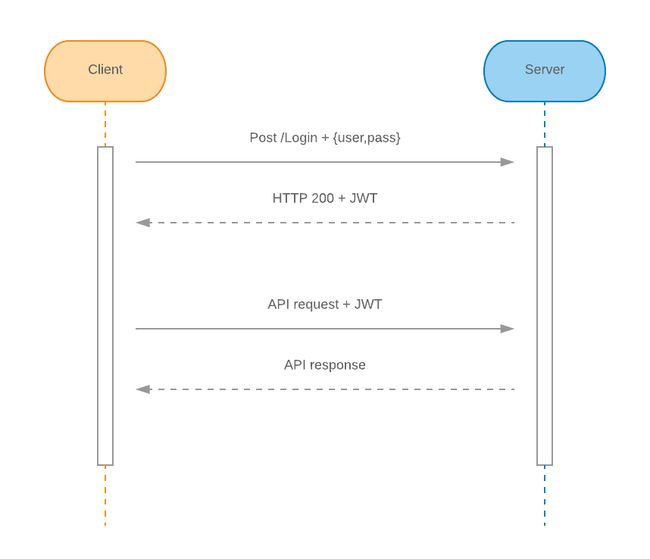
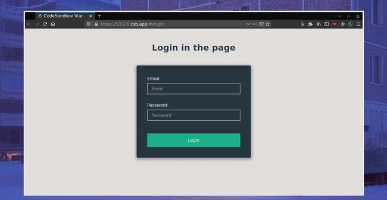
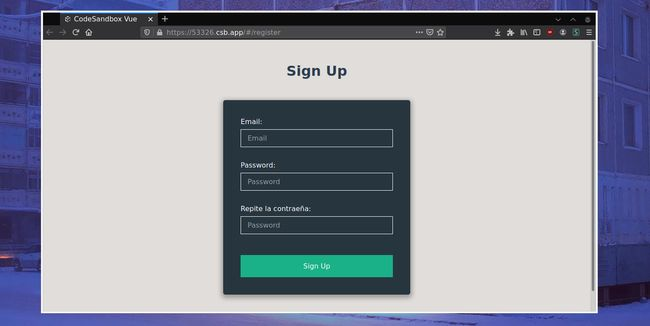

# Autenticación con JWT

## Qué es un sistema de autenticación con token JWT

Antes de empezar vamos a ver rápidamente que es esto de JWT ya que es el sistema de autenticación que vamos a usar.

JWT es un sistema de autenticación que se basa en el uso de tokens. El mecanismo es el siguiente, el usuario hace login en la página y Angular envía al servidor el nombre de usuario y su contraseña. El servidor comprueba si el usuario existe en la base de datos y si la contraseña es correcta y envía a la página web un token generado específicamente para ese usuario. Ese token está firmado por lo que no se puede modificar. La página web guarda ese token y cuando el usuario accede a otra página o ejecuta una acción en la página que dependa del servidor envía el token almacenado.

En resumidas cuentas, se genera un token en servidor, la página se lo guarda en la cookie o en memoria y por cada petición a la API se envía el token para que el servidor compruebe si el usuario tiene permisos. De esta forma se consigue que se puedan proteger llamadas a la API sin necesidad de pasar usuario y contraseña en cada petición (solo se pasa el token).

## 

🗺️ Hoja de ruta
<ul>
  <li>Crear y maquetar las vistas de login y registro con formularios</li>
  <li>Conectar el sistema de registro con la API</li>
  <li>Conectar el sistema de login con la API</li>
  <li>Recordar la sesión iniciada al recargar la página</li>
</ul>

## Creando las vistas. Formulario de login y registro

Lo primero que vamos a hacer es maquetar los dos formularios, sin lógica por el momento. Para ello vamos a crear dos componentes, uno para la vista de login y otro para la vista del registro.

Ambos componentes los vamos a añadir a las rutas que tengamos en <a href="/vue-router">El router de Vue</a>.

En mi caso en el fichero <strong>router.js</strong> pongo lo siguiente:

<pre class="language-javascript" data-language="javascript">
<code class="language-javascript" data-language="javascript">
  import Vue from "vue";
  import Router from "vue-router";

  import App from "./App";
  import Home from "./views/Home";
  import Login from "./views/Login";
  import Register from "./views/Register";

  Vue.use(Router);

  const routes = [
    { path: "/", component: Home },
    { path: "/login", component: Login },
    { path: "/register", component: Register },
  ];

  const router = new Router({
    routes,

  });

</code></pre>

Simplemente tres rutas, la de la página principal que próximamente protegeremos para que solo entren usuarios logueados, la del formulario del login y la del registro.

De tal forma que lo que hago es crear 3 archivos en la carpeta <strong>views</strong>: Home.vue, Login.vue y Register.vue

La vista de login (login.vue), la he maquetado de la siguiente forma:

<pre class="language-vue" data-language="vue">

<code class="language-vue" data-language="vue">
  &lt;template&gt;
    &lt;div class="login"&gt;
      &lt;h1 class="title"&gt;Login in the page&lt;/h1&gt;
      &lt;form action class="form"&gt;
        &lt;label class="form-label" for="#email"&gt;Email:&lt;/label&gt;
        &lt;input
          class="form-input"
          type="email"
          id="email"
          required
          placeholder="Email"
        /&gt;
        &lt;label class="form-label" for="#password"&gt;Password:&lt;/label&gt;
        &lt;input
          class="form-input"
          type="password"
          id="password"
          placeholder="Password"
        /&gt;
        &lt;input class="form-submit" type="submit" value="Login" /&gt;
      &lt;/form&gt;
    &lt;/div&gt;
  &lt;/template&gt;

  &lt;script&gt;
  export default {};
  &lt;/script&gt;

  &lt;style lang="scss" scoped&gt;
  .login {
    padding: 2rem;
  }
  .title {
    text-align: center;
  }
  .form {
    margin: 3rem auto;
    display: flex;
    flex-direction: column;
    justify-content: center;
    width: 20%;
    min-width: 350px;
    max-width: 100%;
    background: rgba(19, 35, 47, 0.9);
    border-radius: 5px;
    padding: 40px;
    box-shadow: 0 4px 10px 4px rgba(0, 0, 0, 0.3);
  }
  .form-label {
    margin-top: 2rem;
    color: white;
    margin-bottom: 0.5rem;
    &amp;:first-of-type {
      margin-top: 0rem;
    }
  }
  .form-input {
    padding: 10px 15px;
    background: none;
    background-image: none;
    border: 1px solid white;
    color: white;
    &amp;:focus {
      outline: 0;
      border-color: #1ab188;
    }
  }
  .form-submit {
    background: #1ab188;
    border: none;
    color: white;
    margin-top: 3rem;
    padding: 1rem 0;
    cursor: pointer;
    transition: background 0.2s;
    &amp;:hover {
      background: #0b9185;
    }
  }
  &lt;/style&gt;

</code></pre>

Lo único que tiene es el formulario de login con unos estilos que me he inventado, de momento no hay nada de lógica en este componente. Siempre recordad de poner los estilos con <strong>scoped</strong> para que se queden aislados del resto de componentes.

Ahora vamos a añadir los <strong>v-model</strong> en los campos para poder sacar el email y la contraseña que el usuario escribe, para ello:

<pre class="language-vue" data-language="vue">
<code class="language-vue" data-language="vue">
  &lt;template&gt;
    &lt;div class="login"&gt;
      &lt;h1 class="title"&gt;Login in the page&lt;/h1&gt;
      &lt;form action class="form"&gt;
        &lt;label class="form-label" for="#email"&gt;Email:&lt;/label&gt;
        &lt;input
          v-model="email"
          class="form-input"
          type="email"
          id="email"
          required
          placeholder="Email"
        /&gt;
        &lt;label class="form-label" for="#password"&gt;Password:&lt;/label&gt;
        &lt;input
          v-model="password"
          class="form-input"
          type="password"
          id="password"
          placeholder="Password"
        /&gt;
        &lt;input class="form-submit" type="submit" value="Login" /&gt;
      &lt;/form&gt;
    &lt;/div&gt;
  &lt;/template&gt;

  &lt;script&gt;
  export default {
    data: () =&gt; ({
      email: "",
      password: "",
    }),
  };
  &lt;/script&gt;

</code></pre>

No tiene más, dos <strong>v-model</strong> apuntando a variables definidas en la sección data del componente para poder recibir los dos valores. Toca preparar el método para enviar la petición de login:

<pre class="language-vue" data-language="vue">
<code class="language-vue" data-language="vue">
  &lt;template&gt;
    &lt;div class="login"&gt;
      &lt;h1 class="title"&gt;Login in the page&lt;/h1&gt;
      &lt;form action class="form" @submit.prevent="login"&gt;
        &lt;label class="form-label" for="#email"&gt;Email:&lt;/label&gt;
        &lt;input
          v-model="email"
          class="form-input"
          type="email"
          id="email"
          required
          placeholder="Email"
        /&gt;
        &lt;label class="form-label" for="#password"&gt;Password:&lt;/label&gt;
        &lt;input
          v-model="password"
          class="form-input"
          type="password"
          id="password"
          placeholder="Password"
        /&gt;
        &lt;input class="form-submit" type="submit" value="Login" /&gt;
      &lt;/form&gt;
    &lt;/div&gt;
  &lt;/template&gt;

  &lt;script&gt;
  export default {
    data: () =&gt; ({
      email: "",
      password: "",
    }),
    methods: {
      login() {
        console.log(this.email);
        console.log(this.password);
      },
    },
  };
  &lt;/script&gt;

</code></pre>

De momento solo se escriben los dos valores por <strong>consola</strong> para probar que se guardan bien en las variables los valores. Nada muy complicado de momento. Vamos a maquetar por último el mensaje de error con un <strong>v-if</strong> para que se muestre si el usuario ha metido mal el email o la contraseña:

<pre class="language-vue" data-language="vue">
<code class="language-vue" data-language="vue">
  &lt;template&gt;
    &lt;div class="login"&gt;
      &lt;h1 class="title"&gt;Login in the page&lt;/h1&gt;
      &lt;form action class="form" @submit.prevent="login"&gt;
        &lt;label class="form-label" for="#email"&gt;Email:&lt;/label&gt;
        &lt;input
          v-model="email"
          class="form-input"
          type="email"
          id="email"
          required
          placeholder="Email"
        /&gt;
        &lt;label class="form-label" for="#password"&gt;Password:&lt;/label&gt;
        &lt;input
          v-model="password"
          class="form-input"
          type="password"
          id="password"
          placeholder="Password"
        /&gt;
        &lt;p v-if="error" class="error"&gt;
          Has introducido mal el email o la contraseña.
        &lt;/p&gt;
        &lt;input class="form-submit" type="submit" value="Login" /&gt;
      &lt;/form&gt;
    &lt;/div&gt;
  &lt;/template&gt;

  &lt;script&gt;
  export default {
    data: () =&gt; ({
      email: "",
      password: "",
      error: false,
    }),
    methods: {
      login() {
        console.log(this.email);
        console.log(this.password);
      },
    },
  };
  &lt;/script&gt;

</code></pre>

Listo, componente maquetado por el momento, vamos a maquetar el del formulario de registro para prepararlos para conectar al backend.

El componente del registro es <strong>igual</strong> solo que añadiendo un campo nuevo para que el usuario repita su contraseña:

<pre class="language-vue" data-language="vue">
<code class="language-vue" data-language="vue">
  &lt;template&gt;
    &lt;div class="register"&gt;
      &lt;h1 class="title"&gt;Sign Up&lt;/h1&gt;
      &lt;form action class="form" @submit.prevent="register"&gt;
        &lt;label class="form-label" for="#email"&gt;Email:&lt;/label&gt;
        &lt;input
          v-model="email"
          class="form-input"
          type="email"
          id="email"
          required
          placeholder="Email"
        /&gt;
        &lt;label class="form-label" for="#password"&gt;Password:&lt;/label&gt;
        &lt;input
          v-model="password"
          class="form-input"
          type="password"
          id="password"
          placeholder="Password"
        /&gt;
        &lt;label class="form-label" for="#password-repeat"
          &gt;Repite la contraeña:&lt;/label
        &gt;
        &lt;input
          v-model="passwordRepeat"
          class="form-input"
          type="password"
          id="password-repeat"
          placeholder="Password"
        /&gt;
        &lt;input class="form-submit" type="submit" value="Sign Up" /&gt;
      &lt;/form&gt;
    &lt;/div&gt;
  &lt;/template&gt;

  &lt;script&gt;
  export default {
    data: () =&gt; ({
      email: "",
      password: "",
      passwordRepeat: "",
    }),
    methods: {
      register() {
        console.log(this.email);
        console.log(this.password);
        console.log(this.passwordRepeat);
      },
    },
  };
  &lt;/script&gt;

  &lt;style lang="scss" scoped&gt;
  .register {
    padding: 2rem;
  }
  .title {
    text-align: center;
  }
  .form {
    margin: 3rem auto;
    display: flex;
    flex-direction: column;
    justify-content: center;
    width: 20%;
    min-width: 350px;
    max-width: 100%;
    background: rgba(19, 35, 47, 0.9);
    border-radius: 5px;
    padding: 40px;
    box-shadow: 0 4px 10px 4px rgba(0, 0, 0, 0.3);
  }
  .form-label {
    margin-top: 2rem;
    color: white;
    margin-bottom: 0.5rem;
    &amp;:first-of-type {
      margin-top: 0rem;
    }
  }
  .form-input {
    padding: 10px 15px;
    background: none;
    background-image: none;
    border: 1px solid white;
    color: white;
    &amp;:focus {
      outline: 0;
      border-color: #1ab188;
    }
  }
  .form-submit {
    background: #1ab188;
    border: none;
    color: white;
    margin-top: 3rem;
    padding: 1rem 0;
    cursor: pointer;
    transition: background 0.2s;
    &amp;:hover {
      background: #0b9185;
    }
  }
  .error {
    margin: 1rem 0 0;
    color: #ff4a96;
  }
  &lt;/style&gt;

</code></pre>

🎉 Pues listo, primera tarea completada, hacemos commit y pasamos a la siguiente.

<strong>✅ Crear y maquetar las vistas de login y registro con formularios</strong>

## Conectando el registro al servidor

Lógicamente para poder conectar el login y registro necesitamos un servidor (encargado de almacenar los usuarios en base de datos ya que desde javascript no se puede). Para ello necesitas una API, puedes crear tú mismo una API usando alguna tecnología de backend como nodejs, java o python. Como de lo que se trata es de aprender, para este ejemplo voy a usar esta <strong>API de pruebas</strong> ya creada que tú también puedes usar.

La API en cuestión es la de: <a href="https://reqres.in/" target="_blank" rel="noopener">https://reqres.in/</a>. Te permite mandar peticions de login y registro además de muchas otras para hacer pruebas.

Lo primero que vamos a hacer es conectar el registro, para ello voy a crear una carpeta llamada <strong>logic</strong> dentro de la carpeta <strong>src</strong> del proyecto. Yo la he llamado logic pero la puedes llamar como quieras. Dentro de esa carpeta voy a crear un archivo llamado <strong>auth.js</strong> en el que voy a colocar la petición de registro y la de login.

Por el momento dentro del archivo de <strong>auth.js</strong> voy a crear esto:

<pre class="language-javascript" data-language="javascript">
<code class="language-javascript" data-language="javascript">
  import axios from "axios";

  const ENDPOINT_PATH = "https://reqres.in/api/";

  export default {
    register(email, password) {
      const user = { email, password };
      return axios.post(ENDPOINT_PATH + "regiser", user);
    },
  };

</code></pre>

Lo primero es importar axios, si no lo tienes instalado en el proyecto ejecuta:

<pre class="language-bash" data-language="bash">
<code class="language-bash" data-language="bash">
  npm install axios --save
</code></pre>

Lo siguiente que hago es definir una constante para endpoint de la API. Luego exporto un objeto para poder usar desde fuera este fichero con el método de registro de usuarios.

Dentro del método de registro se construye el objeto <strong>user</strong> que se enviará en la petición POST de registro de usuarios. Por último se llama a axios para que haga el POST y devuelva la promesa.

Vamos ahora a usar este fichero desde el componente de registro. Lo primero que se hace es importar el fichero encima del <strong>export default del componente</strong>:

<pre class="language-vue" data-language="vue">
<code class="language-vue" data-language="vue">
// ... import auth from "@/logic/auth"; export default { data: () =&gt; ({ // ...
</code></pre>

¿Recuerdas el métoodo que creaste que simplemente tenía los console.log? Pues hay que cambiar eso por esto otro:

<pre class="language-javascript" data-language="javascript">
<code class="language-javascript" data-language="javascript">
  // ...
  methods: {
    register() {
      auth.register(this.email, this.password).then(response =&gt; {
        console.log(response);
      })
    }
  }
  // ...
</code></pre>

Como el método register del archivo <strong>auth</strong> devuelve una promesa lo que hay que hacer es crear a continuación el <strong>then</strong> para capturar la respuesta asíncrona.

Si ejecutas el código y escribes en el formulario el email <strong><a href="mailto:eve.holt@reqres.in" target="_blank" rel="noopener">eve.holt@reqres.in</a></strong> y la contraseña <strong>pistol</strong> y le das a registrar verás que se devuelve la respuesta de la API, en este caso un <strong>201 created</strong>.

La forma de resolver la asincronía con el <strong>then</strong> está bien pero creo que con <strong>async/await</strong> queda todo más claro:

<pre class="language-javascript" data-language="javascript">
<code class="language-javascript" data-language="javascript">
  methods: {
    async register() {
      const response = await auth.register(this.email, this.password);
      console.log(response);
    }
  }
</code></pre>

Por último podemos crear una variable en el data para mostrar error si el usuario ha metido mal el usuario y contraseña. Para capturar el error en la petición podemos usar <strong>try/catch.</strong> De paso vamos a poner que si el registro es correcto lleve al usuario a la página de inicio. Veamos como queda todo el componente:

<pre class="language-vue" data-language="vue">
<code class="language-vue" data-language="vue">
  &lt;template&gt;
    &lt;div class="register"&gt;
      &lt;h1 class="title"&gt;Sign Up&lt;/h1&gt;
      &lt;form action class="form" @submit.prevent="register"&gt;
        &lt;label class="form-label" for="#email"&gt;Email:&lt;/label&gt;
        &lt;input
          v-model="email"
          class="form-input"
          type="email"
          id="email"
          required
          placeholder="Email"
        /&gt;
        &lt;label class="form-label" for="#password"&gt;Password:&lt;/label&gt;
        &lt;input
          v-model="password"
          class="form-input"
          type="password"
          id="password"
          placeholder="Password"
        /&gt;
        &lt;label class="form-label" for="#password-repeat"
          &gt;Repite la contraeña:&lt;/label
        &gt;
        &lt;input
          v-model="passwordRepeat"
          class="form-input"
          type="password"
          id="password-repeat"
          placeholder="Password"
        /&gt;
        &lt;input class="form-submit" type="submit" value="Sign Up" /&gt;
      &lt;/form&gt;
    &lt;/div&gt;
  &lt;/template&gt;

  &lt;script&gt;
  import auth from "@/logic/auth";
  export default {
    data: () =&gt; ({
      email: "",
      password: "",
      passwordRepeat: "",
      error: false,
    }),
    methods: {
      async register() {
        try {
          await auth.register(this.email, this.password);
          this.$router.push("/");
        } catch (error) {
          console.log(error);
        }
      },
    },
  };
  &lt;/script&gt;

  &lt;style lang="scss" scoped&gt;
  .register {
    padding: 2rem;
  }
  .title {
    text-align: center;
  }
  .form {
    margin: 3rem auto;
    display: flex;
    flex-direction: column;
    justify-content: center;
    width: 20%;
    min-width: 350px;
    max-width: 100%;
    background: rgba(19, 35, 47, 0.9);
    border-radius: 5px;
    padding: 40px;
    box-shadow: 0 4px 10px 4px rgba(0, 0, 0, 0.3);
  }
  .form-label {
    margin-top: 2rem;
    color: white;
    margin-bottom: 0.5rem;
    &amp;:first-of-type {
      margin-top: 0rem;
    }
  }
  .form-input {
    padding: 10px 15px;
    background: none;
    background-image: none;
    border: 1px solid white;
    color: white;
    &amp;:focus {
      outline: 0;
      border-color: #1ab188;
    }
  }
  .form-submit {
    background: #1ab188;
    border: none;
    color: white;
    margin-top: 3rem;
    padding: 1rem 0;
    cursor: pointer;
    transition: background 0.2s;
    &amp;:hover {
      background: #0b9185;
    }
  }
  .error {
    margin: 1rem 0 0;
    color: #ff4a96;
  }
  &lt;/style&gt;

</code></pre>

Listo, sistema de registro de usuarios terminado, tarea completad, toca hacer commit.

<strong>✅ Conectar el sistema de registro con la API</strong>

## Sistema de login

Una vez tenemos el sistema de registro el de login debería ser más fácil porque básicamente es repetir lo mismo que antes solo que cambiando la ruta del endpoint.

En el fichero de <strong>auth.js</strong> añadimos:

<pre class="language-javascript" data-language="javascript">
<code class="language-javascript" data-language="javascript">
import axios from "axios";

const ENDPOINT_PATH = "https://reqres.in/api/";

export default {
  register(email, password) {
    const user = { email, password };
    return axios.post(ENDPOINT_PATH + "regiser", user);
  },
  login(email, password) {
    const user = { email, password };
    return axios.post(ENDPOINT_PATH + "login", user);
  },
};
</code></pre>

Y en el componente de login llamamos a este fichero de la misma manera que en el registro, solo que cuando haya error activamos la variable <strong>error</strong> a true para que en el formulario se muestre un error avisando de que el email o la contraseña están mal:

<pre class="language-vue" data-language="vue">
<code class="language-vue" data-language="vue">
  &lt;template&gt;
    &lt;div class="login"&gt;
      &lt;h1 class="title"&gt;Login in the page&lt;/h1&gt;
      &lt;form action class="form" @submit.prevent="login"&gt;
        &lt;label class="form-label" for="#email"&gt;Email:&lt;/label&gt;
        &lt;input
          v-model="email"
          class="form-input"
          type="email"
          id="email"
          required
          placeholder="Email"
        /&gt;
        &lt;label class="form-label" for="#password"&gt;Password:&lt;/label&gt;
        &lt;input
          v-model="password"
          class="form-input"
          type="password"
          id="password"
          placeholder="Password"
        /&gt;
        &lt;p v-if="error" class="error"&gt;
          Has introducido mal el email o la contraseña.
        &lt;/p&gt;
        &lt;input class="form-submit" type="submit" value="Login" /&gt;
      &lt;/form&gt;
      &lt;p class="msg"&gt;
        ¿No tienes cuenta?
        &lt;router-link to="/register"&gt;Regístrate&lt;/router-link&gt;
      &lt;/p&gt;
    &lt;/div&gt;
  &lt;/template&gt;

  &lt;script&gt;
  import auth from "@/logic/auth";
  export default {
    data: () =&gt; ({
      email: "",
      password: "",
      error: false,
    }),
    methods: {
      async login() {
        try {
          await auth.login(this.email, this.password);
          this.$router.push("/");
        } catch (error) {
          this.error = true;
        }
      },
    },
  };
  &lt;/script&gt;

  &lt;style lang="scss" scoped&gt;
  .login {
    padding: 2rem;
  }
  .title {
    text-align: center;
  }
  .form {
    margin: 3rem auto;
    display: flex;
    flex-direction: column;
    justify-content: center;
    width: 20%;
    min-width: 350px;
    max-width: 100%;
    background: rgba(19, 35, 47, 0.9);
    border-radius: 5px;
    padding: 40px;
    box-shadow: 0 4px 10px 4px rgba(0, 0, 0, 0.3);
  }
  .form-label {
    margin-top: 2rem;
    color: white;
    margin-bottom: 0.5rem;
    &amp;:first-of-type {
      margin-top: 0rem;
    }
  }
  .form-input {
    padding: 10px 15px;
    background: none;
    background-image: none;
    border: 1px solid white;
    color: white;
    &amp;:focus {
      outline: 0;
      border-color: #1ab188;
    }
  }
  .form-submit {
    background: #1ab188;
    border: none;
    color: white;
    margin-top: 3rem;
    padding: 1rem 0;
    cursor: pointer;
    transition: background 0.2s;
    &amp;:hover {
      background: #0b9185;
    }
  }
  .error {
    margin: 1rem 0 0;
    color: #ff4a96;
  }
  .msg {
    margin-top: 3rem;
    text-align: center;
  }
  &lt;/style&gt;

</code></pre>

Si abres la página de login y pruebas con el email: <strong><a href="mailto:eve.holt@reqres.in" target="_blank" rel="noopener">eve.holt@reqres.in</a></strong> y la contraseña <strong>cityslicka</strong> te debería llevar a la página principal ya que la llamada al login ha salido bien. Si pones otro email y contraseña te debería salir el mensaje de error en pantalla.

Pues otra tarea terminada. Commit y a por la siguiente:

<strong>✅ Conectar el sistema de login con la API</strong>

## Recordando la sesión iniciada mediante cookie

Vamos con una parte fundamental en todo sistema de login, el de guardar el usuario cuando se loguea en una cookie o en el localstorage para que los componentes puedan pintar información del usuario logueado.

Para este ejemplo voy a optar por usar la librería de <a href="%5Bhttps://github.com/js-cookie/js-cookie%5D(https://github.com/js-cookie/js-cookie)">js cookie</a>, para ello lo primero es decargarlo mediante npm:

<pre class="language-bash" data-language="bash">
<code class="language-bash" data-language="bash">
  npm install js-cookie --save
</code></pre>

Ahora lo que voy a hacer es crear dos métodos más dentro del archivo de <strong>auth.js</strong>. Uno de ellos para guardar el usuario logueado y el otro para recuperarlo desde las cookies.

<pre class="language-javascript" data-language="javascript">
<code class="language-javascript" data-language="javascript">
  import axios from "axios";
  import Cookies from "js-cookie";

  const ENDPOINT_PATH = "https://reqres.in/api/";

  export default {
    setUserLogged(userLogged) {
      Cookies.set("userLogged", userLogged);
    },
    getUserLogged() {
      return Cookies.get("userLogged");
    },
    register(email, password) {
      const user = { email, password };
      return axios.post(ENDPOINT_PATH + "regiser", user);
    },
    login(email, password) {
      const user = { email, password };
      return axios.post(ENDPOINT_PATH + "login", user);
    },
  };

</code></pre>

Lo que vamos a hacer ahora en la vista de login es que si la petición de login sale bien tenemos que guardar el usuario en la cookie. El método de login quedaría de esta forma:

<pre class="language-javascript" data-language="javascript">
<code class="language-javascript" data-language="javascript">
  ...
  async login() {
    try {
      await auth.login(this.email, this.password);
      const user = {
        email: this.email
      };
      auth.setUserLogged(user);
      this.$router.push("/");
    } catch (error) {
      console.log(error);
      this.error = true;
    }
  }
  ...

</code></pre>

En el componente de registro podemos hacer lo propio en caso de que queramos que en nuestra aplicación cuando un usuario se registre se autologuee también.

Ahora en la página principal podemos mostrar el usuario logueado, para ello:

<pre class="language-javascript" data-language="javascript">
<code class="language-javascript" data-language="javascript">
  &lt;template&gt;
    &lt;div class="home"&gt;
      &lt;navigation/&gt;
      &lt;h1&gt;Home&lt;/h1&gt;
      &lt;p v-if="userLogged"&gt;User loggued: {{userLogged}}&lt;/p&gt;
    &lt;/div&gt;
  &lt;/template&gt;

  &lt;script&gt;
  import Navigation from "../components/Navigation";
  import auth from "@/logic/auth";
  export default {
    name: "Home",
    components: {
      navigation: Navigation
    },
    computed: {
      userLogged() {
        return auth.getUserLogged();
      }
    }
  };
  &lt;/script&gt;

  &lt;style&gt;
      &lt;/style&gt;

</code></pre>

Pues listo, si has hecho login y refrescas la página verás que el usuario logueado sigue estando porque se guarda en las cookies. Para terminar podemos crear en el archivo <strong>auth.js</strong> un método para cerrar sesión que simplemente borre la cookie:

<pre class="language-javascript" data-language="javascript">
<code class="language-javascript" data-language="javascript">
  deleteUserLogged() {
    Cookies.remove('userLogged');
  }

</code></pre>

<strong>ATENCIÓN</strong>: No recomiendo guardar toda la información del usuario en la cookie, pero lo hecho así en este ejemplo para demostrar cómo guardar cosas en las cookies. En estos casos lo que se suele hacer es guardar un token y no todo el usuario. Más info de esto si buscas <strong>JWT</strong>

Pues la última tarea terminada también. Commit y listo.

La página principal la he dejado sin estilos, pero puedes aprovechar para cambiarlos.

Te dejo el proyecto subido a <strong>Codesanbox</strong> para que puedas jugar con él:

🖥️ <a href="https://codesandbox.io/s/vue-router-53326" target="_blank" rel="noopener">Proyecto completo en codesanbox</a>

Y para terminar te pongo deberes por si quieres seguir aprendiendo:

<ul>
  <li>Mostrar aviso y comprobación en el registro si las dos contraseñas no coinciden</li>
  <li>Deshabilitar el botón con otros estilos mientras que el usuario no meta el email y las contraseñas no coincidan</li>
  <li>Meter más campos en el registro (nombre de usuario por ejemplo) y guardar más información del usuario en las cookies</li>
</ul>

## Conclusiones

Como he dicho muchas veces, mira siempre la consola del navegador porque muchas veces falla algo y no nos damos cuenta hasta que leemos el mensaje ahí.

Espero que te haya gustado este ejemplo práctico y espero que te haya servido para afianzar los conocimientos que ya tenías de Vue. Con esto deberías ser capaz de crear cosas bastante interesantes a partir de aquí.

Echa un vistazo a los <a href="/vue-filters">Filtros de Vue</a> y a las <a href="/vue-directives">Directivas de Vue</a> para que todavía le saques mucho más partido a Vue.

