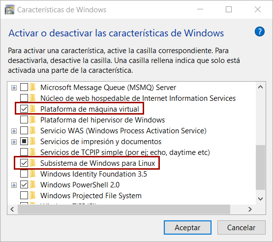
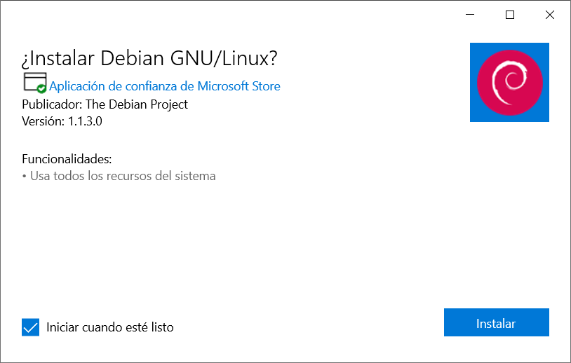

# <span style={{ fontWeight: 'bold', color: '#0f4c81' }}>WSL</span>

Tradicionalmente, Windows ha proporcionado a sus usuarios una interfaz de línea de comandos que funciona bajo su propio sistema, heredado de MS-DOS y diferente a GNU/Linux. Sin embargo, a partir de Windows 10, con la irrupción de __Windows Subsystem for Linux__ (*más comunmente denominado WSL*), esto ha cambiado radicalmente.

## <span style={{ fontWeight: 'bold', color: '#0f4c81' }}>¿Qué es WSL?</span>

Ahora es posible utilizar distribuciones de GNU/Linux como Ubuntu o Debian dentro de nuestro __Windows__, utilizando comandos o aplicaciones de GNU/Linux, incluso las que tienen entorno gráfico. En la siguiente imagen, podemos ver una captura de un sistema GNU/Linux Debian dentro de Windows, a través de [Windows Terminal](https://apps.microsoft.com/detail/9N0DX20HK701?hl=es-es&gl=es "Windows Terminal").


Otros sistemas operativos como GNU/Linux o Mac, disponen de una interfaz de línea de comandos, por lo que hasta el momento era bastante complejo tener compatibilidad entre estos sistemas y uno Windows. Con la adopción de __WSL__ en Windows, Microsoft introduce una capa intermedia que funciona con un __núcleo de Linux real__ (*kernel*) y en el que se pueden instalar distribuciones de GNU/Linux (*desde la tienda oficial de Microsoft o de forma manual*) como por ejemplo __Ubuntu, Debian, Kali__ o incluso la distribución minimalista __Alpine__.

En la siguiente guía, vamos a ver como instalar __WSL__ (*Windows Subsystem for Linux*) en nuestro Windows paso a paso, y luego como configurarlo correctamente (*o resolver ciertos problemas si los hay*).

## <span style={{ fontWeight: 'bold', color: '#0f4c81' }}>Requisitos previos</span>

Para poder disponer de una terminal de GNU/Linux en nuestro Windows, antes necesitamos asegurarnos que nuestro equipo cumple los siguientes requisitos:

- Necesitaremos tener __Windows 10 o superior__ (*cualquier versión salvo Windows S*).
- La [virtualización Hyper-V](https://terminaldelinux.com/terminal/wsl/instalacion-wsl/#virtualizaci%C3%B3n-hyper-v "virtualización Hyper-V") activada en la BIOS/UEFI (*lo normal en equipos nuevos*).
- La característica __Windows Subsystem for Linux__ activada.
- La característica __Plataforma de Máquina Virtual__ activada.
- Se recomienda tener las __actualizaciones de Windows__ al día para mayor compatibilidad.

Recientemente, Microsoft ha añadido una forma automática de instalar WSL en nuestro sistema __WSL__, por lo que te recomiendo echarle primero un vistazo a esta instalación automática, y si no funciona, la instalación manual.

## <span style={{ fontWeight: 'bold', color: '#0f4c81' }}>Instalación automática</span>

Desplegamos el menú de __Inicio__ y escribimos __Símbolo de Sistema__, pulsamos con botón derecho y seleccionamos __Ejecutar como Administrador__. Nos aparece una terminal de texto, donde escribiremos el siguiente comando:

```
  wsl --install -d Debian
```

Personalmente, prefiero instalar __Debian__, pero existen otras [distribuciones de Linux para WSL](https://terminaldelinux.com/terminal/wsl/instalacion-wsl/#qu%C3%A9-distribuciones-puedo-instalar "distribuciones de Linux para WSL"). Si simplemente omitimos el `-d` Debian y escribimos `wsl --install`, se instalará __Ubuntu__, ya que es la distribución por defecto.

Una vez hecho esto, reiniciamos la máquina. Esto realizará los pasos necesarios para tener __WSL__:
- Habilitar las características opcionales necesarias.
- Descargar el último kernel de Linux más reciente.
- Establecer WSL2 como predeterminado.
- Instalar Debian (o Ubuntu) como distribución de Linux en WSL.

Si este método ha funcionado correctamente, al ejecutar el comando wsl --list debería mostrarnos que tenemos una distribución Debian instalada. En ese caso, puedes saltarte la sección __Instalación manual__ e ir directamente a [¿Qué distros tengo en WSL?](https://terminaldelinux.com/terminal/wsl/instalacion-wsl/#qu%C3%A9-distros-tengo-en-wsl "¿Qué distros tengo en WSL?").

## <span style={{ fontWeight: 'bold', color: '#0f4c81' }}>Instalación manual</span>

Si por alguna razón no te ha funcionado la __instalación automática__ (*o no te sirve el comando `wsl --install -d Debian`*) detallo a continuación los pasos que habría seguir para hacerla manualmente.

## <span style={{ fontWeight: 'bold', color: '#0f4c81' }}>Virtualización Hyper-V</span>

En la BIOS/UEFI del equipo, debes tener activada la característica __Virtualización Hyper-V__ o __Hyper-threading virtualization__. Para comprobar si la tenemos activada, pulsamos

```
 ++
```

y vamos al __Administrador de tareas__, a la pestaña __Rendimiento__. Si marcamos __CPU__, en las opciones inferiores podremos ver un texto que dice __Virtualización: Habilitado__:


En ese caso, tenemos la virtualización __Hyper-V__ activada en la BIOS y podemos saltar al siguiente punto. En caso contrario, quizás no se encuentre habilitada y debamos activarla en la BIOS. Dicha característica puede encontrarse en un menú diferente, dependiendo de la marca y modelo de la placa.

Es posible activar esta característica desde el __Símbolo de sistema__ de Windows como administrador, escribiendo el comando `bcdedit /set hypervisorlaunchtype auto`. Para volverla a desactivar, el comando sería `bcdedit /set hypervisorlaunchtype off`.

## <span style={{ fontWeight: 'bold', color: '#0f4c81' }}>Activación de características</span>

Por otro lado, para activar las características mencionadas anteriormente en Windows, accedemos a Inicio y buscamos __Activar o desactivar características de Windows__, donde encontraremos un menú de selección para activar las casillas __Subsistema de Windows para Linux y Plataforma de máquina virtual__:



La primera de ellas es absolutamente necesaria, puesto que es el propio __WSL__. La segunda de ellas es necesaria para utilizar __WSL2__, y es posible que no aparezca si no tienes Windows 10 actualizado. Puedes comprobarlo, accediendo a Inicio y abriendo una terminal de Windows escribiendo __CMD__ o __Símbolo de sistema__ y escribiendo lo siguiente:

```
  > ver

  Microsoft Windows [Versión 10.0.19044.2728]
```

El comando __ver__ nos mostrará la versión instalada de Windows 10. Si es igual o superior a `10.0.19041`, podremos utilizar __WSL2__, en caso contrario, es posible que no podamos utilizar WSL (*o sólo podamos usar __WSL1__*). Para solucionarlo, revisa las actualizaciones de Windows e instala las que tengas pendientes.

> __Nota:__ También es posible comprobar que versión tenemos instalada pulsando

```
  +
```

y escribiendo `winver`. Si tenemos la compilación de SO 19041 o superior, podremos utilizar __WSL2__.

## <span style={{ fontWeight: 'bold', color: '#0f4c81' }}>¿Qué distros tengo en WSL?</span>

Windows __Subsystem for Linux__ funciona de modo que podemos tener varias distribuciones instaladas en nuestro sistema y utilizar la que queramos. Una vez hecho los pasos anteriores, deberíamos disponer de un comando `wsl`.

Para ver que distribuciones tenemos instaladas, abrimos una terminal de Windows pulsando.

```
+
```

y escribiendo cmd. Luego, tecleamos el comando `wsl --list`:

```
  > wsl --list

  El subsistema de Windows para Linux no tiene distribuciones instaladas.
  Para instalar las distribuciones, se puede visitar Microsoft Store:
  https://aka.ms/wslstore
```

En el caso de tener alguna distribución de Linux instalada, nos aparecerían en la lista, como veremos un poco más adelante.

Si en lugar de aparecer el mensaje anterior nos muestra un error al no encontrar el comando `wsl`, es posible que no tengamos aún instalada la característica __Windows Subsystem for Linux__ que mencionamos en el apartado anterior.

## <span style={{ fontWeight: 'bold', color: '#0f4c81' }}>Distribuciones Linux para WSL</span>

__WSL__ permite instalar una serie de distribuciones de Linux específicas, que podemos consultar escribiendo el comando `wsl --list --online`. En este artículo, elegiremos la distribución __Debian__:

```
  > wsl --list --online
  A continuación, se muestra una lista de las distribuciones válidas que se pueden instalar.
  Instalar con 'wsl.exe --install <Distro>'.

  NAME                                   FRIENDLY NAME
  Ubuntu                                 Ubuntu
  Debian                                 Debian GNU/Linux
  kali-linux                             Kali Linux Rolling
  Ubuntu-18.04                           Ubuntu 18.04 LTS
  Ubuntu-20.04                           Ubuntu 20.04 LTS
  Ubuntu-22.04                           Ubuntu 22.04 LTS
  OracleLinux_8_5                        Oracle Linux 8.5
  OracleLinux_7_9                        Oracle Linux 7.9
  SUSE-Linux-Enterprise-Server-15-SP4    SUSE Linux Enterprise Server 15 SP4
  openSUSE-Leap-15.4                     openSUSE Leap 15.4
  openSUSE-Tumbleweed                    openSUSE Tumbleweed
```

Recuerda que la forma automática de instalar una de estas distribuciones es escribiendo `wsl --install -d Debian`, y reemplazando Debian por el nombre de la distribución deseada.

## <span style={{ fontWeight: 'bold', color: '#0f4c81' }}>Instalación manual</span>

Si por alguna razón, preferimos la instalación manual, podemos elegir una de las distribuciones siguientes:

| Distribución | Página oficial | Enlace a tienda Microsoft | Descarga manual (.appx) |
|--------------|--------------|--------------|--------------|
| __Debian Linux__    | [Debian](https://www.debian.org/ "Debian")    | [Debian MS Store](https://apps.microsoft.com/detail/9MSVKQC78PK6?hl=es-es&gl=ES "Debian MS Store")    | [Debian .appx](https://aka.ms/wsl-debian-gnulinux "Debian .appx")    |
| __Ubuntu Linux__    | [Ubuntu](https://ubuntu.com/ "Ubuntu")    | [Ubuntu MS Store](https://apps.microsoft.com/detail/9N6SVWS3RX71?hl=es-es&gl=ES "Ubuntu MS Store")    | [Ubuntu 20.04 .appx](https://aka.ms/wslubuntu2004 "Ubuntu 20.04 .appx")    |
| __Kali Linux__    | [Kali](https://www.kali.org/ "Kali")    | [Kali MS Store](https://www.microsoft.com/es-es/p/kali-linux/9pkr34tncv07 "Kali MS Store")    | [Kali Linux .appx](https://aka.ms/wsl-kali-linux-new "Kali Linux .appx")    |
| __Open Suse__    | [Open Suse](https://www.opensuse.org/ "Open Suse")    | [Open Suse MS Store](https://www.microsoft.com/es-es/p/opensuse-leap-15-1/9njfzk00fgkv "Open Suse MS Store")    | [Open Suse .appx](https://aka.ms/wsl-opensuse-42 "Open Suse .appx")    |
| __Alpine Linux ¹__  | [Alpine](https://alpinelinux.org/ "Alpine")    | [Alpine MS Store](https://www.microsoft.com/es-es/p/alpine-wsl/9p804crf0395 "Alpine MS Store")    |     |

¹ No oficial.

Las distribuciones se pueden instalar automáticamente desde la [tienda oficial de Microsoft](https://www.microsoft.com/es-es "tienda oficial de Microsoft"), o manualmente, ejecutando un archivo .appx que contiene la distribución de Linux a instalar. Si lo hacemos de la primera forma, se instalará de forma transparente, si lo hacemos de la segunda forma, nos mostrará una ventana similar a la siguiente:



Simplemente, pulsamos Instalar y esperamos a que termine la instalación.

## <span style={{ fontWeight: 'bold', color: '#0f4c81' }}>Instalación de la distro</span>

Una vez elegida la distribución de Linux e iniciado el proceso de instalación en nuestro sistema, tras esperar un corto espacio de tiempo, si la arrancamos por primera vez, nos aparecerá una ventana similar a la siguiente:

```
  Installing, this may take a few minutes...
  Please create a default UNIX user account. The username does not need to match your Windows username.
  For more information visit: https://aka.ms/wslusers
  Enter new UNIX username:
```

En ella, se nos está preguntando por el __nombre de usuario__ y su correspondiente __contraseña__ para utilizar en nuestra distribución de Linux de WSL. Es muy importante que apuntemos estas credenciales, puesto que son las que necesitaremos para acceder a nuestro Linux de WSL. Atento a las siguientes indicaciones:

- El nombre de usuario __debe estar en minúsculas__.
- No es necesario que coincida con el nombre de usuario de Windows.
- No debe tener signos de puntuación o acentuación.

Ten en cuenta que el __nombre de usuario__ que escribas va a ser el que utilizarás en WSL de forma habitual. Por ejemplo, si utilizamos el nombre de usuario __manz__, nuestra carpeta de usuario será `/home/manz`.

Listo. Ya tenemos __WSL activada__ con nuestra distribución de GNU/Linux instalada. Ahora, lo recomendable sería revisar el apartado de [Configuración de WSL](https://terminaldelinux.com/terminal/wsl/configuracion-wsl/ "Configuración de WSL") para asegurarnos de que todo está correctamente o mejorar algunos apartados.
